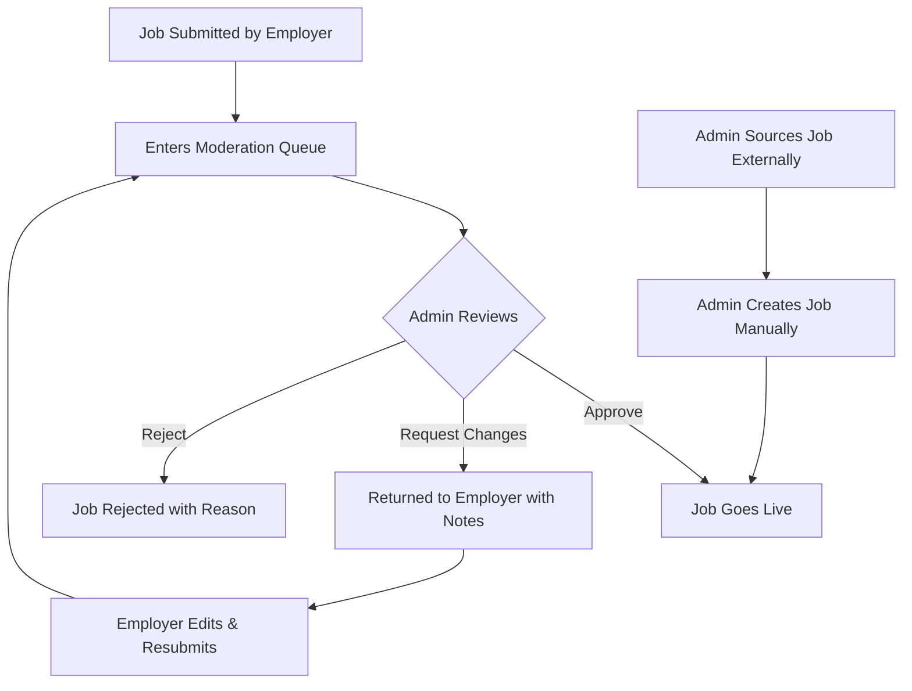
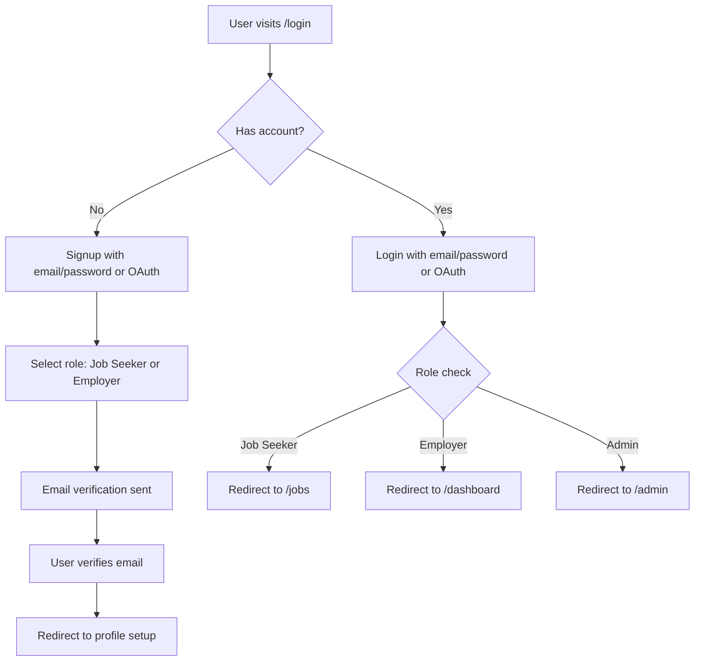
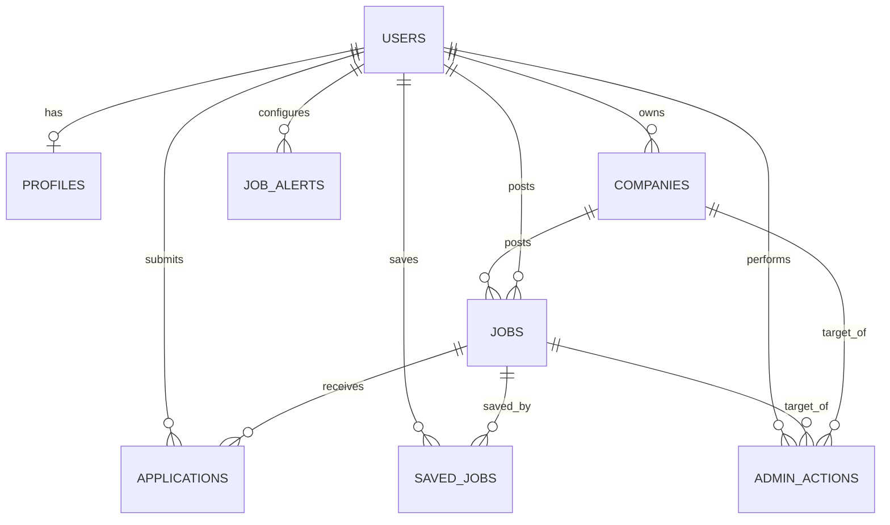

# Product Requirements Document (PRD)

## FrontendJobs.in — Curated Front-End Job Portal for India

**Version:** 1.0
**Last Updated:** 2026-02-12
**Status:** Draft

---

## Table of Contents

1. [Product Vision & Overview](#1-product-vision--overview)
2. [User Personas](#2-user-personas)
3. [Core Features — Job Seeker Portal](#3-core-features--job-seeker-portal)
4. [Core Features — Employer Portal](#4-core-features--employer-portal)
5. [Core Features — Admin Portal](#5-core-features--admin-portal)
6. [Authentication & Authorization](#6-authentication--authorization)
7. [Tech Stack Recommendations](#7-tech-stack-recommendations)
8. [Database Schema](#8-database-schema-high-level)
9. [Pages / Routes](#9-pages--routes)
10. [SEO & Marketing](#10-seo--marketing)
11. [Monetization Ideas](#11-monetization-ideas)
12. [MVP Scope vs Future Scope](#12-mvp-scope-vs-future-scope)
13. [Non-Functional Requirements](#13-non-functional-requirements)
14. [Success Metrics / KPIs](#14-success-metrics--kpis)

---

## 1. Product Vision & Overview

### Elevator Pitch

**FrontendJobs.in** is India's first curated job portal exclusively for front-end developers. Every job listing is hand-picked and verified by our editorial team — no scraped listings, no spam, no ghost jobs. Quality over quantity.

### Problem Statement

Front-end developers in India face several pain points when job hunting:

- **Signal-to-noise ratio:** Major job portals like Naukri, LinkedIn, and Indeed are flooded with irrelevant, duplicate, and outdated listings. Developers waste hours sifting through low-quality posts.
- **Ghost jobs:** Many listings are posted for compliance or branding purposes with no real intent to hire.
- **Lack of specialization:** General job portals don't cater to the specific needs of front-end developers — filtering by framework, understanding of modern tooling, or relevant salary benchmarks in INR.
- **Poor employer quality signals:** It's hard to distinguish between genuine opportunities at good companies and mass-hiring body shops.

### Target Audience

- **Primary:** Front-end developers in India — from freshers to senior/lead engineers — who specialize in React, Vue, Angular, Next.js, Svelte, and related technologies.
- **Secondary:** Employers and recruiters in India looking to hire quality front-end talent.
- **Tertiary:** Full-stack developers with strong front-end skills.

### Unique Value Proposition

| Aspect | Other Portals | FrontendJobs.in |
|--------|--------------|-----------------|
| Job sourcing | Scraped / aggregated / self-serve | Hand-picked & curated by editors |
| Quality | Thousands of low-quality listings | Fewer, high-quality verified jobs |
| Focus | All roles, all industries | Front-end development only |
| Currency | Often USD-centric | INR salary ranges, India-focused |
| Relevance | Generic filters | Framework-specific filters — React, Vue, Angular, Next.js, etc. |
| Trust | Unknown verification | Every listing reviewed before publishing |

### Core Principles

1. **Curation over aggregation** — Every job is reviewed by a human before it goes live.
2. **Developer-first UX** — Clean, fast, no-nonsense interface built by developers, for developers.
3. **India-first** — Salary in INR, Indian cities, understanding of the Indian tech hiring landscape.
4. **Transparency** — Salary ranges required, company info verified, no hidden details.

---

## 2. User Personas

### Persona 1: Job Seeker — Junior Developer (Priya)

| Attribute | Detail |
|-----------|--------|
| **Age** | 22-25 |
| **Experience** | 0-2 years |
| **Skills** | HTML, CSS, JavaScript, React basics |
| **Goal** | Land first or second front-end role at a good product company |
| **Pain Points** | Overwhelmed by job portals, unsure about salary expectations, can't filter by tech stack |
| **Behavior** | Checks jobs daily, applies to 5-10 per week, values mentorship and learning opportunities |

### Persona 2: Job Seeker — Mid-Level Developer (Rahul)

| Attribute | Detail |
|-----------|--------|
| **Age** | 25-30 |
| **Experience** | 3-6 years |
| **Skills** | React/Next.js, TypeScript, state management, testing, CI/CD |
| **Goal** | Move to a better company with higher pay, remote-friendly, modern stack |
| **Pain Points** | Too many irrelevant listings, tired of recruiter spam, wants salary transparency |
| **Behavior** | Passive job seeker, browses weekly, bookmarks interesting roles, wants email alerts |

### Persona 3: Job Seeker — Senior/Lead Developer (Ananya)

| Attribute | Detail |
|-----------|--------|
| **Age** | 30-40 |
| **Experience** | 7+ years |
| **Skills** | Architecture, team leadership, performance optimization, multiple frameworks |
| **Goal** | Find a leadership role at a well-funded startup or top-tier company |
| **Pain Points** | Very few quality senior roles visible, doesn't want to apply to mass-hiring companies |
| **Behavior** | Highly selective, only applies to 1-2 roles per month, values company culture and mission |

### Persona 4: Employer / Recruiter (Vikram)

| Attribute | Detail |
|-----------|--------|
| **Age** | 28-45 |
| **Role** | Engineering Manager / HR / Founder |
| **Company** | Indian startup or mid-size product company |
| **Goal** | Hire quality front-end developers quickly |
| **Pain Points** | Receives hundreds of irrelevant applications on general portals, hard to reach niche talent |
| **Behavior** | Posts 2-5 jobs per quarter, wants a targeted audience, willing to pay for quality |

### Persona 5: Admin / Curator (Internal)

| Attribute | Detail |
|-----------|--------|
| **Role** | Content curator / editor |
| **Goal** | Maintain quality of job listings, grow the platform |
| **Responsibilities** | Review submitted jobs, source jobs from Twitter/LinkedIn/company pages, verify companies, manage content |
| **Tools needed** | Moderation queue, bulk actions, analytics dashboard |

---

## 3. Core Features — Job Seeker Portal

### 3.1 Landing Page

- **Hero section** with tagline, search bar, and key stats — e.g., "250+ curated front-end jobs in India"
- **Featured jobs** carousel/grid — premium placements for paying employers
- **Latest curated jobs** — most recently approved listings
- **Filter quick-links** — "React Jobs", "Remote Jobs", "Bangalore Jobs", "₹25L+ Jobs"
- **How it works** section — explaining the curation process
- **Newsletter signup** — email capture for weekly job digest
- **Trusted by** section — logos of companies that have posted

### 3.2 Job Listing Page (`/jobs`)

- **Full list of curated jobs** with card-based layout
- **Filters sidebar/top bar:**
  - Location: City dropdown — Bangalore, Mumbai, Delhi NCR, Hyderabad, Pune, Chennai, Kolkata, Other
  - Work mode: Remote / Hybrid / On-site
  - Experience level: Junior / Mid / Senior / Lead / Principal
  - Tech stack tags: React, Vue, Angular, Next.js, Svelte, TypeScript, Tailwind CSS, etc.
  - Salary range: ₹3L+, ₹5L+, ₹10L+, ₹15L+, ₹25L+, ₹35L+, ₹50L+
  - Job type: Full-time, Part-time, Contract, Freelance
  - Company size: Startup (1-50), Mid-size (51-200), Large (201-1000), Enterprise (1000+)
  - Posted date: Last 24h, Last 7 days, Last 30 days
- **Sort options:** Newest first, Salary high-to-low, Most relevant
- **Pagination** — 20 jobs per page, server-side
- **URL-synced filters** — shareable filtered URLs like `/jobs?stack=react&location=remote&salary=25`
- **Job count** — "Showing 45 React jobs in Bangalore"

### 3.3 Job Detail Page (`/jobs/[id]`)

- **Company header** — logo, name, tagline, website link, social links
- **Job title and metadata** — location, work mode, salary range, seniority, job type, posted date
- **Tags** — tech stack tags as clickable badges
- **Job description** — rich text with markdown support
- **Responsibilities** — bulleted list
- **Requirements** — bulleted list
- **Benefits & perks** — bulleted list
- **Apply CTA** — prominent button, either:
  - Redirect to company's application page (external URL)
  - In-app apply (future scope) — attach resume, cover letter
- **Share buttons** — Twitter, LinkedIn, WhatsApp, copy link
- **Similar jobs** — related listings based on tags/company
- **Report job** — flag inappropriate listings
- **Save/bookmark** button

### 3.4 Job Search

- **Full-text search** across job titles, descriptions, company names, and tags
- **Autocomplete suggestions** as user types
- **Search from hero section** on homepage redirects to `/jobs?search=query`
- **Search within filtered results** — combine search with active filters
- **Recent searches** — stored in localStorage for quick access

### 3.5 Save / Bookmark Jobs

- **Heart/bookmark icon** on each job card and detail page
- **Saved jobs page** (`/saved-jobs`) — list of all bookmarked jobs
- **Requires authentication** — prompt login if not signed in
- **Persist in database** — synced across devices
- **Remove from saved** — toggle bookmark off

### 3.6 Apply to Jobs

- **Primary flow (MVP):** Redirect to external application URL provided by employer
- **Future flow:** In-app application with:
  - Auto-fill from profile (name, email, resume)
  - Cover letter text field
  - Additional questions set by employer
  - Application confirmation email

### 3.7 Email Alerts / Job Notifications

- **Job alert setup** — user defines criteria: tech stack, location, salary range, work mode
- **Frequency options:** Daily digest, Weekly digest, Instant (for new matches)
- **Email template** — clean, mobile-friendly HTML email with job cards
- **Unsubscribe** — one-click unsubscribe link in every email
- **Manage alerts** — settings page to edit/delete alert preferences

### 3.8 User Profile

- **Profile page** (`/profile`) with:
  - Display name, email, avatar
  - Bio / headline
  - Skills tags (React, TypeScript, etc.)
  - Years of experience
  - Current location
  - Preferred work mode
  - Expected salary range
  - Resume upload (PDF, max 5MB)
  - Portfolio URL, GitHub URL, LinkedIn URL
- **Profile completeness indicator** — encourage users to fill out all fields
- **Privacy settings** — control visibility to employers

### 3.9 Application Tracker

- **My Applications page** (`/applications`) showing:
  - Job title, company, date applied
  - Status: Applied → In Review → Shortlisted → Rejected
  - Status is updated by employer or auto-tracked
- **Filter by status** — view only shortlisted, only rejected, etc.
- **Notes** — personal notes per application

---

## 4. Core Features — Employer Portal

### 4.1 Employer Registration & Company Profile

- **Signup flow** — separate employer registration with company details
- **Company profile page** (`/companies/[id]`) visible to job seekers:
  - Company name, logo, tagline
  - Description / about
  - Website, social links (Twitter, LinkedIn, GitHub)
  - Company size, founded year, headquarters
  - Tech stack used
  - Culture & values
  - Photos / office images (future)
- **Verification badge** — admin-verified companies get a checkmark
- **All jobs by company** — listed on company profile page

### 4.2 Post a Job

- **Job posting form** (`/post-job`) with fields:
  - Job title (required)
  - Company (select from user's companies or create new)
  - Location — city name (required)
  - Work mode — Remote / Hybrid / On-site (required)
  - Job type — Full-time / Part-time / Contract / Freelance (required)
  - Seniority — Junior / Mid / Senior / Lead / Principal (required)
  - Salary range — min and max in INR LPA (required for transparency)
  - Description — rich text editor (required)
  - Responsibilities — list input (required)
  - Requirements — list input (required)
  - Benefits — list input (optional)
  - Tech stack tags — multi-select from predefined list (required)
  - Application URL — external link or email (required)
  - Featured listing — paid upgrade option
- **Preview before submit** — see how the job will look
- **Submit for review** — job enters moderation queue (not published immediately)
- **Confirmation** — email notification when job is approved/rejected

### 4.3 Manage Posted Jobs

- **Employer dashboard** (`/dashboard`) with:
  - List of all posted jobs with status: Pending Review / Active / Paused / Closed / Rejected
  - **Edit** — modify job details (re-enters moderation if significant changes)
  - **Pause** — temporarily hide from listings
  - **Close** — mark as filled, remove from listings
  - **Duplicate** — create a new job based on existing one
  - **Delete** — permanently remove

### 4.4 View Applicants

- **Applicants list per job** — name, email, resume, applied date
- **Application status management** — move applicants through stages
- **Download resumes** — bulk or individual
- **Contact applicant** — send message via platform (future)
- **Export to CSV** — download applicant data

### 4.5 Employer Dashboard Analytics

- **Per-job metrics:**
  - Total views
  - Unique views
  - Applications received
  - Conversion rate (views → applications)
  - Save/bookmark count
- **Aggregate metrics:**
  - Total jobs posted
  - Total applications across all jobs
  - Average time to first application
- **Time-series charts** — views and applications over time

---

## 5. Core Features — Admin Portal

### 5.1 Admin Dashboard (`/admin`)

- **Key metrics at a glance:**
  - Total active jobs
  - Total registered users (job seekers + employers)
  - Total applications this week/month
  - Jobs pending review
  - New signups this week
  - Revenue from featured listings
- **Quick actions:** Approve pending jobs, view flagged content
- **Activity feed** — recent actions (new jobs submitted, new users, applications)

### 5.2 Job Moderation Queue (`/admin/jobs/moderation`)

This is the **core differentiator** — the curation workflow:



- **Moderation queue** — list of all pending jobs sorted by submission date
- **Review interface:**
  - Full job preview
  - Company verification status
  - Admin notes field
  - Actions: Approve / Request Changes / Reject
  - Rejection reasons: Duplicate, Spam, Incomplete, Not front-end, Low quality, Other
- **Bulk actions** — approve or reject multiple jobs
- **Quality checklist** for curators:
  - Is this a genuine front-end role?
  - Is the company legitimate?
  - Is the salary range provided and reasonable?
  - Is the description detailed enough?
  - Are requirements clear and fair?

### 5.3 Manual Job Addition (`/admin/jobs/create`)

- Admin can **source and add jobs manually** from:
  - Company career pages
  - Twitter/X job posts
  - LinkedIn listings
  - Developer community channels
- Same form as employer job posting but with additional admin fields:
  - Source URL
  - Curator notes
  - Auto-approve (skip moderation)

### 5.4 User Management (`/admin/users`)

- **User list** with search and filters (role, signup date, status)
- **User detail view** — profile, activity, posted jobs, applications
- **Actions:** Ban/suspend user, edit role, send notification, delete account
- **Bulk actions** — export users, send bulk emails

### 5.5 Employer / Company Management (`/admin/companies`)

- **Company list** with verification status
- **Verification workflow:**
  - Review company details, website, social presence
  - Mark as Verified (adds badge) or Unverified
  - Request additional information from employer
- **Company detail view** — all jobs posted, employer users linked

### 5.6 Content Management

- **Blog posts** — create, edit, publish, unpublish articles
- **Featured jobs** — manually select jobs to feature on homepage
- **Banners** — promotional banners for homepage or job listing page
- **Static pages** — about, contact, terms, privacy policy

### 5.7 Analytics & Reporting (`/admin/analytics`)

- **Platform-wide metrics:**
  - User growth over time
  - Job posting trends
  - Application volume
  - Most popular tech stacks
  - Top cities
  - Employer engagement
- **Export reports** — CSV/PDF download
- **Funnel analysis** — visitor → signup → profile complete → application

---

## 6. Authentication & Authorization

### 6.1 Authentication Methods

| Method | Priority | Details |
|--------|----------|---------|
| Email + Password | MVP | Standard signup/login with email verification |
| Google OAuth | MVP | One-click signup — most common for Indian users |
| GitHub OAuth | MVP | Relevant for developer audience |
| LinkedIn OAuth | Phase 2 | Professional network integration |
| Magic Link | Phase 2 | Passwordless email login |

### 6.2 Signup & Login Flow



### 6.3 Role-Based Access Control (RBAC)

| Resource | Job Seeker | Employer | Admin |
|----------|-----------|----------|-------|
| View jobs | ✅ | ✅ | ✅ |
| Apply to jobs | ✅ | ❌ | ❌ |
| Save/bookmark jobs | ✅ | ❌ | ✅ |
| Post a job | ❌ | ✅ | ✅ |
| Manage own jobs | ❌ | ✅ | ✅ (all) |
| View applicants | ❌ | ✅ (own jobs) | ✅ (all) |
| Company profile | ❌ | ✅ (own) | ✅ (all) |
| Admin dashboard | ❌ | ❌ | ✅ |
| Moderate jobs | ❌ | ❌ | ✅ |
| Manage users | ❌ | ❌ | ✅ |

### 6.4 Security Features

- **Email verification** — required before posting jobs or applying
- **Password requirements** — minimum 8 characters, at least one number and one letter
- **Password reset** — via email link with time-limited token
- **JWT tokens** — managed by Supabase Auth, stored in HTTP-only cookies
- **Session management** — auto-refresh tokens, configurable session duration
- **Rate limiting** — on login attempts, job applications, and API calls
- **CSRF protection** — via Supabase's built-in mechanisms
- **Row Level Security (RLS)** — database-level access control via Supabase

---

## 7. Tech Stack Recommendations

### Frontend

| Technology | Purpose | Rationale |
|-----------|---------|-----------|
| **Next.js 16 (App Router)** | Framework | SSR/SSG for SEO, API routes, file-based routing, React Server Components |
| **React 19** | UI library | Latest features, server components support |
| **TypeScript** | Language | Type safety, better DX, fewer runtime errors |
| **Tailwind CSS v4** | Styling | Utility-first, rapid development, consistent design |
| **shadcn/ui** | Component library | Accessible, customizable, Tailwind-native components |
| **Framer Motion** | Animations | Smooth page transitions and micro-interactions |
| **Lucide React** | Icons | Consistent, lightweight icon set |
| **Zod** | Validation | Schema validation for forms and API inputs |

### Backend

| Technology | Purpose | Rationale |
|-----------|---------|-----------|
| **Next.js API Routes** | API layer | Co-located with frontend, serverless, easy deployment |
| **Supabase** | BaaS | PostgreSQL, Auth, Storage, Realtime — all-in-one |
| **Supabase Edge Functions** | Serverless functions | For complex business logic, webhooks, cron jobs |

### Database & Storage

| Technology | Purpose | Rationale |
|-----------|---------|-----------|
| **Supabase PostgreSQL** | Primary database | Relational, full-text search, RLS, mature ecosystem |
| **Supabase Storage** | File storage | Resumes, company logos, blog images |
| **Supabase Realtime** | Live updates | Real-time notifications for new jobs (future) |

### Auth

| Technology | Purpose | Rationale |
|-----------|---------|-----------|
| **Supabase Auth** | Authentication | Built-in OAuth providers, email/password, JWT, session management |
| **@supabase/ssr** | Auth helpers | Server-side auth for Next.js App Router |

### Email

| Technology | Purpose | Rationale |
|-----------|---------|-----------|
| **Resend** | Transactional email | Developer-friendly API, React Email templates, good deliverability |
| **React Email** | Email templates | Build emails with React components |

### Search

| Technology | Purpose | Rationale |
|-----------|---------|-----------|
| **Supabase Full-Text Search** | MVP search | Built-in PostgreSQL `tsvector`, no extra service needed |
| **Algolia** | Phase 2 search | Typo tolerance, faceted search, instant results (when scale demands it) |

### Deployment & Infrastructure

| Technology | Purpose | Rationale |
|-----------|---------|-----------|
| **Vercel** | Hosting | Optimized for Next.js, edge network, preview deployments |
| **GitHub Actions** | CI/CD | Automated testing, linting, deployment |
| **Sentry** | Error tracking | Real-time error monitoring and alerting |
| **Vercel Analytics** | Web analytics | Core Web Vitals, page performance |
| **PostHog** | Product analytics | User behavior, funnels, feature flags (Phase 2) |

---

## 8. Database Schema (High-Level)

### Entity Relationship Diagram



### Tables

#### `profiles`

Extends Supabase `auth.users` with application-specific data.

| Column | Type | Constraints | Description |
|--------|------|-------------|-------------|
| id | UUID | PK, FK → auth.users.id | User ID from Supabase Auth |
| role | ENUM | NOT NULL, DEFAULT 'job_seeker' | 'job_seeker', 'employer', 'admin' |
| display_name | TEXT | | User's display name |
| headline | TEXT | | Short bio/headline |
| avatar_url | TEXT | | Profile picture URL |
| skills | TEXT[] | DEFAULT '{}' | Array of skill tags |
| experience_years | INTEGER | | Years of experience |
| location | TEXT | | Current city |
| preferred_work_mode | TEXT | | Remote/Hybrid/On-site |
| expected_salary_min | INTEGER | | Min expected salary in LPA |
| expected_salary_max | INTEGER | | Max expected salary in LPA |
| resume_url | TEXT | | Uploaded resume URL |
| portfolio_url | TEXT | | Portfolio website |
| github_url | TEXT | | GitHub profile |
| linkedin_url | TEXT | | LinkedIn profile |
| is_profile_public | BOOLEAN | DEFAULT false | Visible to employers? |
| is_banned | BOOLEAN | DEFAULT false | Admin ban flag |
| created_at | TIMESTAMPTZ | DEFAULT NOW() | |
| updated_at | TIMESTAMPTZ | DEFAULT NOW() | |

#### `companies`

Already exists in the current schema. Extended fields:

| Column | Type | Constraints | Description |
|--------|------|-------------|-------------|
| id | UUID | PK, DEFAULT uuid_generate_v4() | |
| name | TEXT | NOT NULL | Company name |
| slug | TEXT | UNIQUE, NOT NULL | URL-friendly name |
| logo | TEXT | | Logo URL |
| tagline | TEXT | | Short description |
| description | TEXT | | Full company description |
| website | TEXT | | Company website |
| twitter | TEXT | | Twitter handle |
| github | TEXT | | GitHub org |
| linkedin | TEXT | | LinkedIn page |
| size | TEXT | | 'startup', 'mid', 'large', 'enterprise' |
| founded_year | INTEGER | | Year founded |
| headquarters | TEXT | | HQ city |
| tech_stack | TEXT[] | DEFAULT '{}' | Technologies used |
| is_verified | BOOLEAN | DEFAULT false | Admin-verified |
| user_id | UUID | FK → auth.users.id | Owner |
| created_at | TIMESTAMPTZ | DEFAULT NOW() | |

#### `jobs`

Extended from current schema:

| Column | Type | Constraints | Description |
|--------|------|-------------|-------------|
| id | UUID | PK, DEFAULT uuid_generate_v4() | |
| title | TEXT | NOT NULL | Job title |
| slug | TEXT | UNIQUE, NOT NULL | URL-friendly title |
| company_id | UUID | FK → companies.id, ON DELETE CASCADE | |
| location | TEXT | NOT NULL | City name |
| location_type | ENUM | NOT NULL | 'Remote', 'On-site', 'Hybrid' |
| salary_min | INTEGER | | Min salary in LPA |
| salary_max | INTEGER | | Max salary in LPA |
| salary_range | TEXT | | Display string e.g. '₹15L - ₹25L' |
| job_type | ENUM | NOT NULL | 'Full-time', 'Part-time', 'Contract', 'Freelance' |
| seniority | ENUM | NOT NULL | 'Junior', 'Mid', 'Senior', 'Lead', 'Principal' |
| description | TEXT | NOT NULL | Rich text job description |
| responsibilities | TEXT[] | DEFAULT '{}' | |
| requirements | TEXT[] | DEFAULT '{}' | |
| benefits | TEXT[] | DEFAULT '{}' | |
| tags | TEXT[] | DEFAULT '{}' | Tech stack tags |
| apply_url | TEXT | NOT NULL | External application link |
| status | ENUM | DEFAULT 'pending_review' | 'pending_review', 'active', 'paused', 'closed', 'rejected' |
| is_featured | BOOLEAN | DEFAULT false | Paid featured listing |
| is_verified | BOOLEAN | DEFAULT false | Admin verified |
| rejection_reason | TEXT | | Why job was rejected |
| admin_notes | TEXT | | Internal curator notes |
| source_url | TEXT | | For admin-sourced jobs |
| views_count | INTEGER | DEFAULT 0 | Total page views |
| applications_count | INTEGER | DEFAULT 0 | Total applications |
| user_id | UUID | FK → auth.users.id | Poster |
| created_at | TIMESTAMPTZ | DEFAULT NOW() | |
| published_at | TIMESTAMPTZ | | When approved and went live |
| expires_at | TIMESTAMPTZ | | Auto-close date |

#### `applications`

| Column | Type | Constraints | Description |
|--------|------|-------------|-------------|
| id | UUID | PK | |
| job_id | UUID | FK → jobs.id, ON DELETE CASCADE | |
| user_id | UUID | FK → auth.users.id | Applicant |
| status | ENUM | DEFAULT 'applied' | 'applied', 'in_review', 'shortlisted', 'rejected', 'hired' |
| resume_url | TEXT | | Resume used for this application |
| cover_letter | TEXT | | Optional cover letter |
| notes | TEXT | | Applicant's personal notes |
| employer_notes | TEXT | | Employer's internal notes |
| created_at | TIMESTAMPTZ | DEFAULT NOW() | |
| updated_at | TIMESTAMPTZ | DEFAULT NOW() | |

**Unique constraint:** `(job_id, user_id)` — one application per job per user.

#### `saved_jobs`

| Column | Type | Constraints | Description |
|--------|------|-------------|-------------|
| id | UUID | PK | |
| user_id | UUID | FK → auth.users.id | |
| job_id | UUID | FK → jobs.id, ON DELETE CASCADE | |
| created_at | TIMESTAMPTZ | DEFAULT NOW() | |

**Unique constraint:** `(user_id, job_id)`

#### `job_alerts`

| Column | Type | Constraints | Description |
|--------|------|-------------|-------------|
| id | UUID | PK | |
| user_id | UUID | FK → auth.users.id | |
| name | TEXT | | Alert name e.g. 'React Remote Jobs' |
| filters | JSONB | NOT NULL | Stored filter criteria |
| frequency | ENUM | DEFAULT 'weekly' | 'instant', 'daily', 'weekly' |
| is_active | BOOLEAN | DEFAULT true | |
| last_sent_at | TIMESTAMPTZ | | |
| created_at | TIMESTAMPTZ | DEFAULT NOW() | |

#### `admin_actions`

Audit log for all admin actions.

| Column | Type | Constraints | Description |
|--------|------|-------------|-------------|
| id | UUID | PK | |
| admin_id | UUID | FK → auth.users.id | Admin who performed action |
| action_type | TEXT | NOT NULL | 'approve_job', 'reject_job', 'ban_user', 'verify_company', etc. |
| target_type | TEXT | NOT NULL | 'job', 'user', 'company' |
| target_id | UUID | NOT NULL | ID of the target entity |
| details | JSONB | | Additional context |
| created_at | TIMESTAMPTZ | DEFAULT NOW() | |

#### `blog_posts` (Phase 2)

| Column | Type | Constraints | Description |
|--------|------|-------------|-------------|
| id | UUID | PK | |
| title | TEXT | NOT NULL | |
| slug | TEXT | UNIQUE, NOT NULL | |
| content | TEXT | NOT NULL | Markdown content |
| excerpt | TEXT | | Short summary |
| cover_image | TEXT | | Featured image URL |
| author_id | UUID | FK → auth.users.id | |
| status | ENUM | DEFAULT 'draft' | 'draft', 'published' |
| tags | TEXT[] | DEFAULT '{}' | |
| published_at | TIMESTAMPTZ | | |
| created_at | TIMESTAMPTZ | DEFAULT NOW() | |

### Key Relationships

- A **User** has one **Profile** (1:1)
- A **User** can own multiple **Companies** (1:N)
- A **Company** can have multiple **Jobs** (1:N)
- A **User** (job seeker) can submit multiple **Applications** (1:N)
- A **Job** can receive multiple **Applications** (1:N)
- A **User** can save multiple **Jobs** via **SavedJobs** (M:N)
- A **User** can configure multiple **JobAlerts** (1:N)
- **AdminActions** logs all moderation activity with polymorphic target

### Indexes

- `jobs.status` — filter active jobs
- `jobs.tags` — GIN index for array containment queries
- `jobs.location_type` — filter by work mode
- `jobs.seniority` — filter by level
- `jobs.created_at` — sort by newest
- `jobs.salary_min, jobs.salary_max` — salary range queries
- Full-text search index on `jobs.title`, `jobs.description` using `tsvector`
- `applications(job_id, user_id)` — unique constraint + lookup
- `saved_jobs(user_id, job_id)` — unique constraint + lookup

---

## 9. Pages / Routes

### Public Pages (No Auth Required)

| Route | Page | Description |
|-------|------|-------------|
| `/` | Landing Page | Hero, featured jobs, latest jobs, newsletter signup |
| `/jobs` | Job Listings | All curated jobs with filters and search |
| `/jobs/[slug]` | Job Detail | Full job description, apply CTA |
| `/companies` | Companies | Browse all companies |
| `/companies/[slug]` | Company Detail | Company profile + their jobs |
| `/blog` | Blog | Front-end articles, salary guides, tips |
| `/blog/[slug]` | Blog Post | Individual article |
| `/about` | About | About the platform, curation process |
| `/contact` | Contact | Contact form |
| `/terms` | Terms of Service | Legal |
| `/privacy` | Privacy Policy | Legal |

### Auth Pages

| Route | Page | Description |
|-------|------|-------------|
| `/login` | Login | Email/password + OAuth login |
| `/signup` | Signup | Registration with role selection |
| `/forgot-password` | Forgot Password | Email input for reset link |
| `/reset-password` | Reset Password | New password form (with token) |
| `/verify-email` | Email Verification | Confirmation page |

### Job Seeker Pages (Auth Required, Role: job_seeker)

| Route | Page | Description |
|-------|------|-------------|
| `/profile` | My Profile | Edit profile, skills, resume |
| `/saved-jobs` | Saved Jobs | Bookmarked jobs list |
| `/applications` | My Applications | Application tracker with statuses |
| `/alerts` | Job Alerts | Manage email alert preferences |
| `/settings` | Settings | Account settings, notifications, privacy |

### Employer Pages (Auth Required, Role: employer)

| Route | Page | Description |
|-------|------|-------------|
| `/dashboard` | Employer Dashboard | Overview, stats, quick actions |
| `/dashboard/jobs` | My Jobs | List of posted jobs with status |
| `/dashboard/jobs/[id]/edit` | Edit Job | Modify job listing |
| `/dashboard/jobs/[id]/applicants` | View Applicants | Applications for a specific job |
| `/dashboard/company` | Company Profile | Edit company details |
| `/post-job` | Post a Job | Job submission form |

### Admin Pages (Auth Required, Role: admin)

| Route | Page | Description |
|-------|------|-------------|
| `/admin` | Admin Dashboard | Key metrics, activity feed |
| `/admin/jobs` | All Jobs | Manage all jobs on platform |
| `/admin/jobs/moderation` | Moderation Queue | Review pending jobs |
| `/admin/jobs/create` | Add Job Manually | Source and add external jobs |
| `/admin/users` | User Management | View, edit, ban users |
| `/admin/companies` | Company Management | Verify, manage companies |
| `/admin/analytics` | Analytics | Platform-wide reporting |
| `/admin/blog` | Blog Management | Create/edit blog posts |
| `/admin/blog/create` | Create Blog Post | New article editor |
| `/admin/blog/[id]/edit` | Edit Blog Post | Modify existing article |
| `/admin/settings` | Admin Settings | Platform configuration |

---

## 10. SEO & Marketing

### Technical SEO

- **Server-Side Rendering (SSR)** — all job pages rendered on server for crawlability
- **Dynamic metadata** — unique title, description, and OG tags per job page using Next.js `generateMetadata`
- **Structured Data (JSON-LD)** — `JobPosting` schema on every job detail page:
  ```json
  {
    "@context": "https://schema.org",
    "@type": "JobPosting",
    "title": "Senior React Developer",
    "description": "...",
    "datePosted": "2026-02-10",
    "validThrough": "2026-03-10",
    "employmentType": "FULL_TIME",
    "hiringOrganization": {
      "@type": "Organization",
      "name": "TechCorp India",
      "sameAs": "https://techcorp.in",
      "logo": "https://..."
    },
    "jobLocation": {
      "@type": "Place",
      "address": {
        "@type": "PostalAddress",
        "addressLocality": "Bangalore",
        "addressCountry": "IN"
      }
    },
    "baseSalary": {
      "@type": "MonetaryAmount",
      "currency": "INR",
      "value": {
        "@type": "QuantitativeValue",
        "minValue": 1500000,
        "maxValue": 2500000,
        "unitText": "YEAR"
      }
    }
  }
  ```
- **Sitemap** — auto-generated `sitemap.xml` with all job and company pages
- **Robots.txt** — proper crawl directives
- **Canonical URLs** — prevent duplicate content from filtered pages
- **Clean URLs** — `/jobs/senior-react-developer-techcorp-bangalore` using slugs

### Content Marketing

- **Blog section** (`/blog`) with categories:
  - Salary guides — "Front-End Developer Salary in India 2026"
  - Interview prep — "Top 50 React Interview Questions"
  - Career advice — "How to Transition from Backend to Frontend"
  - Tech deep-dives — "Next.js vs Remix: Which to Learn in 2026"
  - Market trends — "State of Front-End Hiring in India Q1 2026"
- **Publishing cadence** — 2-4 articles per month
- **SEO-optimized** — target long-tail keywords relevant to Indian front-end developers

### Social & Distribution

- **Social sharing buttons** on every job post — Twitter, LinkedIn, WhatsApp (important for India)
- **Open Graph images** — auto-generated job card images for social previews
- **Twitter/X presence** — share new curated jobs daily
- **LinkedIn page** — company page with job updates
- **Newsletter** — weekly digest of best curated jobs, sent via Resend
- **WhatsApp/Telegram groups** — community channels (Phase 2)

---

## 11. Monetization Ideas

### Revenue Stream 1: Featured Job Listings

| Tier | Price | Benefits |
|------|-------|----------|
| Standard | Free | Listed in main feed, basic visibility |
| Featured | ₹2,999/job | Highlighted on homepage, "Featured" badge, top of search results, social media promotion |
| Premium | ₹4,999/job | All Featured benefits + newsletter inclusion + dedicated social post |

### Revenue Stream 2: Employer Subscription Plans

| Plan | Price | Includes |
|------|-------|----------|
| Starter | Free | 1 active job listing, basic analytics |
| Growth | ₹4,999/month | 5 active listings, full analytics, priority review |
| Pro | ₹9,999/month | 15 active listings, featured badge on company, applicant management tools |
| Enterprise | Custom | Unlimited listings, dedicated account manager, API access |

### Revenue Stream 3: Resume Database Access

- Employers can browse profiles of job seekers who opt-in
- Pricing: ₹14,999/month for unlimited profile views and contact access
- Phase 2 feature — requires sufficient user base

### Revenue Stream 4: Sponsored Content

- Sponsored blog posts from dev tool companies
- Banner ads on job listing pages (tasteful, relevant)
- Newsletter sponsorship slots

### Revenue Stream 5: Career Services (Phase 3)

- Resume review service
- Mock interview sessions
- Front-end skill assessments / certifications

---

## 12. MVP Scope vs Future Scope

### Phase 1 — MVP (Weeks 1-6)

**Goal:** Launch a functional curated job board with core job seeker and admin flows.

- [x] Landing page with hero, featured jobs, latest jobs
- [ ] Job listing page with filters (location, work mode, seniority, tech stack, salary)
- [ ] Job detail page with full description and external apply link
- [ ] Full-text job search
- [ ] Email/password authentication
- [ ] Google OAuth login
- [ ] GitHub OAuth login
- [ ] User profiles (basic — name, email, role)
- [ ] Employer job posting form
- [ ] Admin job moderation queue (approve/reject)
- [ ] Admin manual job addition
- [ ] Basic admin dashboard with metrics
- [ ] Company profiles (basic)
- [ ] SEO — metadata, JSON-LD, sitemap
- [ ] Mobile-responsive design
- [ ] Deployment on Vercel + Supabase

### Phase 2 — Growth (Weeks 7-12)

**Goal:** Add engagement features, employer tools, and monetization.

- [ ] Save/bookmark jobs
- [ ] Application tracker
- [ ] Email alerts / job notifications (daily/weekly digest)
- [ ] Enhanced user profiles (resume upload, skills, portfolio)
- [ ] Employer dashboard with analytics
- [ ] View applicants per job
- [ ] In-app job application flow
- [ ] Featured job listings (paid)
- [ ] Employer subscription plans
- [ ] Blog section with CMS
- [ ] Newsletter with Resend
- [ ] Company verification workflow
- [ ] Password reset flow
- [ ] Toast notifications
- [ ] Dark mode
- [ ] Pagination (server-side)
- [ ] Advanced search with Algolia

### Phase 3 — Scale (Weeks 13-24)

**Goal:** Build community, expand features, and scale.

- [ ] Resume database for recruiters
- [ ] LinkedIn OAuth
- [ ] Magic link login
- [ ] Real-time notifications (Supabase Realtime)
- [ ] Employer messaging / chat with applicants
- [ ] Salary insights / benchmarking tool
- [ ] Skill assessments / coding challenges
- [ ] Mobile app (React Native or PWA)
- [ ] API for third-party integrations
- [ ] WhatsApp/Telegram job alerts
- [ ] Community forum / discussions
- [ ] Referral program
- [ ] Multi-language support (Hindi, regional languages)
- [ ] AI-powered job recommendations
- [ ] Company reviews and ratings

---

## 13. Non-Functional Requirements

### Performance

| Metric | Target |
|--------|--------|
| Largest Contentful Paint (LCP) | < 2.5s |
| First Input Delay (FID) | < 100ms |
| Cumulative Layout Shift (CLS) | < 0.1 |
| Time to First Byte (TTFB) | < 200ms |
| Job listing page load | < 1.5s |
| Search results | < 500ms |

**Strategies:**
- Server-side rendering for initial page loads
- Static generation for blog posts and company pages
- Image optimization with Next.js `Image` component
- Edge caching via Vercel CDN
- Database query optimization with proper indexes
- Lazy loading for below-the-fold content

### Security

- **HTTPS everywhere** — enforced via Vercel
- **Row Level Security (RLS)** — Supabase policies on all tables
- **Input sanitization** — prevent XSS via React's built-in escaping + server-side validation with Zod
- **SQL injection prevention** — parameterized queries via Supabase client
- **Rate limiting** — on auth endpoints, job posting, and applications
- **CORS** — restricted to allowed origins
- **Content Security Policy (CSP)** — strict headers
- **Dependency auditing** — regular `npm audit` and Dependabot alerts
- **Data encryption** — at rest (Supabase) and in transit (TLS)
- **GDPR-like compliance** — user data export, account deletion

### Accessibility (a11y)

- **WCAG 2.1 AA compliance** as target
- Semantic HTML throughout
- Keyboard navigation support
- Screen reader compatibility (ARIA labels, roles)
- Color contrast ratios meeting AA standards
- Focus indicators on interactive elements
- Alt text for all images
- Form labels and error messages
- Skip navigation links
- Tested with axe-core and Lighthouse

### Mobile Responsiveness

- **Mobile-first design** — all pages designed for mobile viewport first
- Breakpoints: 320px (mobile), 768px (tablet), 1024px (desktop), 1280px (wide)
- Touch-friendly tap targets (min 44x44px)
- Responsive navigation — hamburger menu on mobile
- Swipeable job cards (future)
- Bottom navigation bar on mobile (future)

### Reliability

- **Uptime target:** 99.9%
- **Error monitoring:** Sentry integration for real-time alerts
- **Graceful degradation** — fallback UI for failed API calls
- **Error boundaries** — React error boundaries on all page sections
- **Health checks** — API endpoint for monitoring
- **Backup strategy** — Supabase automated daily backups

### Scalability

- **Serverless architecture** — auto-scales with Vercel
- **Database connection pooling** — via Supabase's built-in pooler
- **CDN caching** — static assets and ISR pages cached at edge
- **Designed for:** 10,000 monthly active users in Phase 1, scaling to 100,000+ in Phase 3

---

## 14. Success Metrics / KPIs

### User Acquisition

| Metric | Phase 1 Target | Phase 2 Target |
|--------|---------------|---------------|
| Monthly Active Users (MAU) | 1,000 | 10,000 |
| Registered job seekers | 500 | 5,000 |
| Registered employers | 50 | 200 |
| Newsletter subscribers | 1,000 | 5,000 |

### Engagement

| Metric | Target |
|--------|--------|
| Average session duration | > 3 minutes |
| Pages per session | > 3 |
| Job detail page views per listing | > 50 in first week |
| Bookmark rate | > 10% of job views |
| Return visitor rate | > 40% |
| Email alert open rate | > 35% |
| Email alert click rate | > 10% |

### Job Marketplace

| Metric | Phase 1 Target | Phase 2 Target |
|--------|---------------|---------------|
| Active curated jobs | 100+ | 500+ |
| New jobs added per week | 15-20 | 50+ |
| Applications per job (avg) | 10+ | 25+ |
| Application conversion rate (view → apply) | > 5% | > 8% |
| Employer satisfaction (NPS) | > 40 | > 50 |

### Revenue (Phase 2+)

| Metric | Target |
|--------|--------|
| Monthly Recurring Revenue (MRR) | ₹50,000 by month 6 |
| Featured listing conversion rate | > 15% of employers |
| Employer plan upgrade rate | > 10% free → paid |
| Average Revenue Per Employer | ₹3,000/month |

### Quality & Curation

| Metric | Target |
|--------|--------|
| Job approval rate | 60-80% (selective) |
| Average moderation time | < 24 hours |
| Job report rate | < 1% |
| Expired/ghost job rate | < 5% |
| Salary transparency rate | > 90% of listings |

### Technical

| Metric | Target |
|--------|--------|
| Lighthouse Performance Score | > 90 |
| Lighthouse Accessibility Score | > 90 |
| Core Web Vitals pass rate | 100% |
| API response time (p95) | < 500ms |
| Error rate | < 0.1% |
| Uptime | > 99.9% |

---

## Appendix A: Competitive Landscape

| Platform | Focus | Curation | India-specific |
|----------|-------|----------|---------------|
| Naukri | All jobs | ❌ No | ✅ Yes |
| LinkedIn Jobs | All jobs | ❌ No | Partial |
| Instahyre | Tech jobs | Partial | ✅ Yes |
| Cutshort | Tech jobs | ✅ AI-matched | ✅ Yes |
| Wellfound (AngelList) | Startup jobs | Partial | Partial |
| RemoteOK | Remote jobs | ❌ No | ❌ No |
| **FrontendJobs.in** | **Front-end only** | **✅ Hand-picked** | **✅ Yes** |

Our differentiation: **Niche focus (front-end only) + Human curation + India-first.**

---

## Appendix B: Glossary

| Term | Definition |
|------|-----------|
| LPA | Lakhs Per Annum — Indian salary unit (1 Lakh = ₹1,00,000) |
| RLS | Row Level Security — Supabase/PostgreSQL feature for database-level access control |
| SSR | Server-Side Rendering |
| SSG | Static Site Generation |
| ISR | Incremental Static Regeneration |
| CTA | Call to Action |
| OG | Open Graph — social media preview metadata |
| JSON-LD | JSON for Linking Data — structured data format for SEO |
| RBAC | Role-Based Access Control |
| MAU | Monthly Active Users |
| MRR | Monthly Recurring Revenue |
| NPS | Net Promoter Score |

---

*This PRD is a living document and will be updated as the product evolves. All stakeholders should review and provide feedback before implementation begins.*
